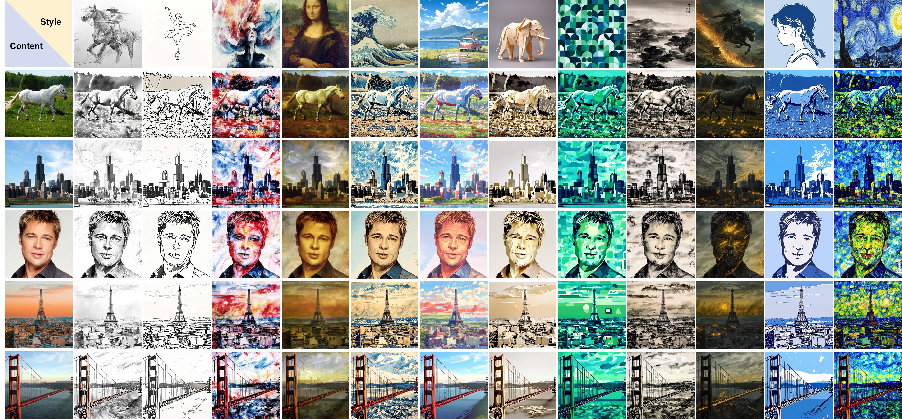

# [CVPR 2025] StyleSSP: Sampling StartPoint Enhancement for Training-free Diffusion-based Method for Style Transfer

### [Arxiv](https://arxiv.org/abs/2501.11319)



## Usage

**To run the code, please follow these step:**

1. [Download](#download)
2. [Setup](#environment-setup)
3. [Run](#run)

### Download

This project contains contributions from [ControlNet](https://github.com/lllyasviel/ControlNet) and [IP-Adapter-Instruct](https://github.com/unity-research/IP-Adapter-Instruct), licensed under the Apache License 2.0. Modifications and additional content added by StyleSSP in 2024. The pre-trained checkpoints from [Tile-ControlNet](https://huggingface.co/xinsir/controlnet-tile-sdxl-1.0), [MistoLine](https://huggingface.co/TheMistoAI/MistoLine), [IP-Adapter-Instruct](https://github.com/unity-research/IP-Adapter-Instruct)

```
# download adapters
huggingface-cli download --resume-download h94/IP-Adapter --local-dir checkpoints/IP-Adapter

# download ControlNets
huggingface-cli download --resume-download TheMistoAI/MistoLine --local-dir checkpoints/MistoLine
huggingface-cli download --resume-download xinsir/controlnet-tile-sdxl-1.0 --local-dir checkpoints/controlnet-tile-sdxl-1.0

# download models IP-Adapter-Instruct
download the models ckpt ip-adapter-instruct-sdxl.bin from: https://huggingface.co/CiaraRowles/IP-Adapter-Instruct and put it in the folder checkpoints/models
```

### Environment Setup

```
conda env create -f environment.yaml
conda activate StyleSSP
pip install git+https://github.com/openai/CLIP.git
```

### Run
For running StyleSSP, modify `content_image_dir` and `style_image_dir` in [src/config.py](src/config.py), then run:
```
python infer_style.py
```

## Evaluation
For a quantitative evaluation, we incorporate a set of randomly selected inputs from [MS-COCO](https://cocodataset.org) and [WikiArt](https://github.com/cs-chan/ArtGAN/tree/master/WikiArt%20Dataset) in "./data" directory, as [InstantStyle-Plus](https://github.com/instantX-research/InstantStyle-Plus) do.

Before executing evalution code, please run `infer_style.py` to get the results (40 styles, 20 contents -> 800 stylized images), then put the content, style and stylized images in "./data_evl/content", "./data_evl/style", and "./data_evl/tar" directory, respectively.

Then, run:
```
cd evaluation;
python eval_artfid.py --sty ../data_evl/style --cnt ../data_evl/content --tar ../data_evl/tar
```

## Citation
If you find our work useful, please consider citing and star:
```
@article{xu2025stylessp,
  title={StyleSSP: Sampling StartPoint Enhancement for Training-free Diffusion-based Method for Style Transfer},
  author={Xu, Ruojun and Xi, Weijie and Wang, Xiaodi and Mao, Yongbo and Cheng, Zach},
  journal={arXiv preprint arXiv:2501.11319},
  year={2025}
}
```
